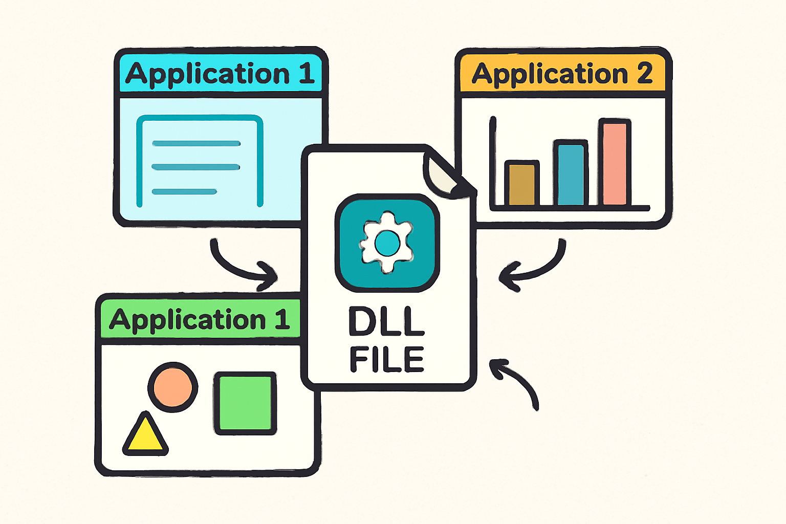
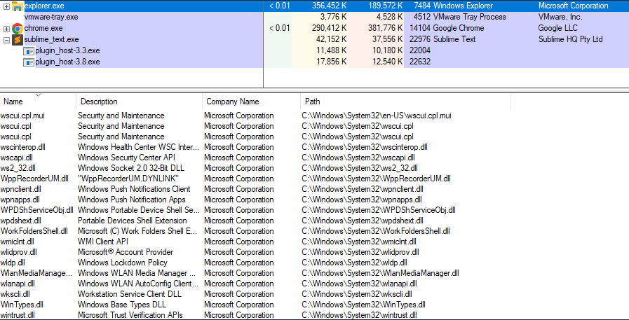

# Dynamic-Link Library (DLL)

## What is a DLL ?

DLL stands for Dynamic Link Library. These are executable files that contain functions and procedures that can be used by multiple applications. Instead of linking libraries during the compilation phase, which would increase the size of the binary, it is more efficient to use DLLs. This way, if a change is needed, only the DLL needs to be updated, and all applications using that DLL will automatically benefit from the updated version.



DLLs cannot run their code independently; instead, executable binaries invoke the functions contained within them. To use these functions, the respective DLL must first be loaded. Commonly used DLLs, such as kernel32.dll, provide essential functions like CreateFileW and others.

Some DLLs are automatically loaded into every process by default because they export functions necessary for the proper execution of the process. Examples of these essential DLLs include ntdll.dll, kernel32.dll, and kernelbase.dll. The image below illustrates several DLLs that are currently loaded by the explorer.exe process.



## System-Wide DLL Base Address

The Windows operating system utilizes a system-wide DLL base address to load certain DLLs at the same base address in the virtual address space of all processes on a given machine. This approach optimizes memory usage and enhances system performance. The following image demonstrates `kernel32.dll` being loaded at the same address (`0x7fff9fad0000`) across multiple running processes.


## Why Do We Use DLL ?

### 🛠️ Modularization of Code

Instead of having a single massive executable that contains all functionality, the code is divided into several independent libraries, each focused on specific tasks. This modularization simplifies development and debugging for developers.

### ♻️ Code Reuse

DLLs promote code reuse, allowing a library to be invoked by multiple processes. This reduces redundancy and streamlines application development.

### 💾 Efficient Memory Usage

When multiple processes require the same DLL, they can save memory by sharing that DLL rather than loading separate instances into each process's memory. This leads to more efficient use of system resources.

## DLL Entry Point

DLLs can optionally specify an entry point function that executes code when specific events occur, such as when a process loads the DLL. There are four possible notifications for the entry point being called:

- 📥 `DLL_PROCESS_ATTACH` when a process is loading the DLL.

- 🧵 `DLL_THREAD_ATTACH` when a process creates a new thread.

- 🧵 `DLL_THREAD_DETACH` when a thread exits normally.

- 📤 `DLL_PROCESS_DETACH` when a process unloads the DLL.

## Example DLL Code

```c
BOOL APIENTRY DllMain(HMODULE hModule, DWORD nReason, LPVOID lpReserved)

{
  switch (nReason) {
  case DLL_PROCESS_ATTACH:
    MessageBox(
      NULL,
      "Meow from evil.dll!",
      "=^..^=",
      MB_OK
    );
    break;
  case DLL_PROCESS_DETACH:
    break;
  case DLL_THREAD_ATTACH:
    break;
  case DLL_THREAD_DETACH:
    break;
  }
  return TRUE;
}
```

## Dynamic Linking

It is possible to use the LoadLibrary, GetModuleHandle, and GetProcAddress WinAPI functions to import a function from a DLL. This process is known as dynamic linking. Dynamic linking allows for loading and linking code (DLLs) at runtime, rather than linking them at compile time using the linker and import address table.

### 🌟 Advantages of Dynamic Linking

There are several advantages to using dynamic linking, which are documented by Microsoft. These include:

- Reduced memory usage
- Improved application modularity
- Easier updates and maintenance

### 🔍 Steps for Dynamic Linking

This section outlines the steps involved in loading a DLL, retrieving the DLL's handle, obtaining the address of the exported function, and then invoking that function:

- Load the DLL: Use LoadLibrary to load the DLL into the process's address space.
  Retrieve the DLL Handle: Use GetModuleHandle to get the handle of the loaded DLL.
- Get the Function Address: Use GetProcAddress to retrieve the address of the desired function exported by the DLL.
- Invoke the Function: Call the function using the retrieved address.

## Loading a DLL

Calling a function such as MessageBoxA automatically causes Windows to load the exporting DLL `user32.dll` into the process address space. In most cases, `user32.dll` is already loaded by the OS at process startup, so no explicit loading is required.

For functions in other DLLs, such as HelloWorld in `sampleDLL.dll`, the DLL may not be loaded by default. Before calling the function, the application must obtain a handle to the DLL. If `sampleDLL.dll` is not already loaded, the application must load it explicitly using LoadLibrary,as shown below

```c
HMODULE hModule = LoadLibraryA("sampleDLL.dll"); // hModule now contain sampleDLL.dll's handle
```

## Retrieving a DLL's Handle

If `sample.dll` is already loaded into the application's memory , could retrieve its handle via the [**GetModuleHandle**](https://learn.microsoft.com/en-us/windows/win32/api/libloaderapi/nf-libloaderapi-getmodulehandlea) Winapi function without the need of **LoadLibrary** function

```c
HMODULE hModule = GetModuleHandleA("sampleDLL.dll");
```

## Retrieving a Function's Address

Once the DLL is loaded into memory and the handle is retrieved, the next step is to retrieve the function's address. This is done using the [**GetProcAddress**](https://learn.microsoft.com/en-us/windows/win32/api/libloaderapi/nf-libloaderapi-getprocaddress) WinAPI which takes the handle of the DLL that exports the function and the function name.

```c
PVOID pHelloWorld = GetProcAddress(hModule, "HelloWorld");
```

## Invoking The Function

Once `HelloWorld`'s address is saved into the `pHelloWorld` variable, the next step is to perform a type-cast on this address to HelloWorld's function pointer. This function pointer is required in order to invoke the function.

```c
// Constructing a new data type that represents HelloWorld's function pointer
typedef void (WINAPI* HelloWorldFunctionPointer)();

void call(){
    HMODULE hModule = LoadLibraryA("sampleDLL.dll");
    PVOID pHelloWorld = GetProcAddress(hModule, "HelloWorld");
    // Type-casting the 'pHelloWorld' variable to be of type 'HelloWorldFunctionPointer'
    HelloWorldFunctionPointer HelloWorld = (HelloWorldFunctionPointer)pHelloWorld;
    HelloWorld();   // Calling the 'HelloWorld' function via its function pointer
}
```

## Dynamic Linking Example

The code below demonstrates another simple example of dynamic linking, where `MessageBoxA` is called. It assumes that `user32.dll` the DLL that exports this function is not already loaded into memory. Recall that if a DLL is not loaded into memory, LoadLibrary must be used to load it into the process’s address space.

```c
typedef int (WINAPI* MessageBoxAFunctionPointer)( // Constructing a new data type, that will represent MessageBoxA's function pointer
  HWND          hWnd,
  LPCSTR        lpText,
  LPCSTR        lpCaption,
  UINT          uType
);

void call(){
    // Retrieving MessageBox's address, and saving it to 'pMessageBoxA' (MessageBoxA's function pointer)
    MessageBoxAFunctionPointer pMessageBoxA = (MessageBoxAFunctionPointer)GetProcAddress(LoadLibraryA("user32.dll"), "MessageBoxA");
    if (pMessageBoxA != NULL){
        // Calling MessageBox via its function pointer if not null
        pMessageBoxA(NULL, "MessageBox's Text", "MessageBox's Caption", MB_OK);
    }
}
```

## How to Run a DLL ?

There are a couple of ways to run exported functions without using a programmatical method. One common technique is to use the rundll32.exe binary. [Rundll32.exe](https://learn.microsoft.com/en-us/windows-server/administration/windows-commands/rundll32) is a built-in Windows binary that is used to run an exported function of a DLL file. To run an exported function use the following command:

```c
rundll32.exe <dllname>, <function exported to run>
```

For example, User32.dll exports the function LockWorkStation which locks the machine. To run the function, use the following command:

```c
rundll32.exe user32.dll,LockWorkStation
```
