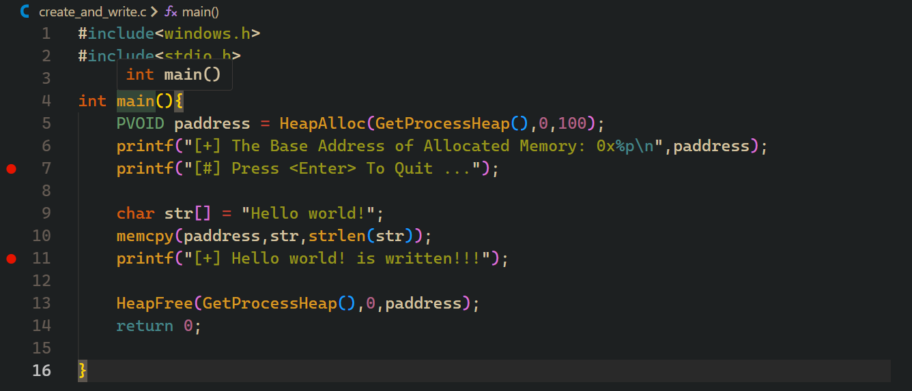

# A Deep Dive into Windows Memory Allocation for C Programmers

Memory management in C is a double-edged sword: it offers unparalleled power and control, but it also demands responsibility. For developers working on Windows, understanding how to allocate and manage memory is not just a skill—it's essential for building robust, efficient, and secure applications.

This guide will walk you through the three primary methods of memory allocation in C on Windows: the standard `malloc()`, the native `HeapAlloc()`, and the legacy `LocalAlloc()`. We'll cover each with practical examples and conclude by showing you how to write data into dynamically allocated memory—a fundamental pattern in Windows development.

## 1. The Standard Approach: `malloc()`

The `malloc()` function is the most common way to allocate memory in C. It's part of the C standard library, making it portable across different operating systems. If you're writing code that needs to run on Windows, Linux, and macOS, `malloc()` is your best friend.

```c
#include <windows.h>
#include <stdio.h>
#include <stdlib.h> // Required for malloc and free

int main() {
    // Allocate 100 bytes of memory
    void* paddress = malloc(100); 
    
    // Always check if allocation was successful
    if (paddress == NULL) {
        printf("Memory allocation failed.\n");
        return 1; // Exit with an error code
    }
    
    printf("[+] Base Address of Allocated Memory: 0x%p \n", paddress);
    
    printf("[#] Press any key to free memory and quit...");
    getchar();
    
    // Free the allocated memory to prevent leaks
    free(paddress); 
    
    return 0;
}
```

### When to Use `malloc()`

-   **Cross-Platform Code:** When your application needs to be portable.
-   **General-Purpose Applications:** For most standard applications, `malloc()` is simple and effective.

### Key Takeaways

-   **Check for `NULL`:** `malloc()` returns `NULL` if it fails to allocate memory. Always check the return value.
-   **Free Your Memory:** For every `malloc()`, there must be a corresponding `free()`. Forgetting to free memory leads to memory leaks.
-   **Platform-Independent:** Works on any system with a standard C library.

## 2. The Native Windows Way: `HeapAlloc()`

For Windows-specific programming, the `HeapAlloc()` API provides more fine-grained control. It allows you to allocate memory from a specific "heap," a region of memory managed by the OS. By default, you can use the process's main heap.

```c
#include <windows.h>
#include <stdio.h>

int main() {
    // Get a handle to the default heap of the current process
    HANDLE hProcessHeap = GetProcessHeap();

    // Allocate 100 bytes from the process heap
    // The second parameter (flags) can be 0 or HEAP_ZERO_MEMORY to zero-initialize the memory
    void* paddress = HeapAlloc(hProcessHeap, 0, 100); 
    
    if (paddress == NULL) {
        printf("HeapAlloc failed with error code: %ld\n", GetLastError());
        return 1;
    }
    
    printf("[+] Base Address Of Allocated Memory: 0x%p \n", paddress);
    
    printf("[#] Press any key to free memory and quit...");
    getchar();
    
    // Free the memory using the same heap handle
    HeapFree(hProcessHeap, 0, paddress); 
    
    return 0;
}
```

### When to Use `HeapAlloc()`

-   **Windows-Specific Applications:** When you are writing code that will only run on Windows.
-   **System-Level Programming:** Ideal for services, drivers, or applications that need to manage memory efficiently.
-   **Multiple Heaps:** Advanced scenarios where you might create separate heaps for different components to improve performance or security.

### Key Takeaways

-   **Heap Handle is Key:** You need a handle to the heap you want to allocate from. `GetProcessHeap()` is the most common choice.
-   **Paired Functions:** Always pair `HeapAlloc()` with `HeapFree()`, and make sure to use the *same heap handle* for both.
-   **Error Handling:** If `HeapAlloc` fails, you can call `GetLastError()` to get more information about the failure.

## 3. The Legacy Method: `LocalAlloc()`

`LocalAlloc()` is a legacy Windows API that dates back to 16-bit Windows. While modern Windows memory management has unified local and global heaps, this function is maintained for backward compatibility. You might encounter it in older codebases.

```c
#include <windows.h>
#include <stdio.h>

int main() {
    // Allocate 100 bytes. LPTR combines LMEM_FIXED and LMEM_ZEROINIT,
    // so the memory is fixed and zero-initialized.
    void* paddress = LocalAlloc(LPTR, 100); 
    
    if (paddress == NULL) {
        printf("LocalAlloc failed with error code: %ld\n", GetLastError());
        return 1;
    }
    
    printf("[+] Base address of Allocated Memory: 0x%p \n", paddress);
    
    printf("[#] Press any key to free memory and quit...");
    getchar();
    
    // Free the memory using LocalFree
    LocalFree(paddress); 
    
    return 0;
}
```

### When to Use `LocalAlloc()`

-   **Maintaining Legacy Code:** When you are working on an old codebase that already uses it.
-   **Specific WinAPI requirements:** Some older Windows APIs might require memory allocated with `LocalAlloc`.

For all new development, **`HeapAlloc()` is the recommended choice** over `LocalAlloc()`.

## Compiling and Running the Examples

You can compile these examples using either MinGW (GCC) or the Microsoft Visual C++ Compiler (MSVC).

### MinGW (gcc)

Open a Command Prompt and run:
```bash
gcc your_filename.c -o your_program.exe
your_program.exe
```

### Microsoft Visual Studio (cl.exe)

Open the "Developer Command Prompt for VS" and run:
```bash
cl your_filename.c
your_filename.exe
```
*Make sure to replace `your_filename.c` with the name of your source file.*

## Bonus: Writing Data to Allocated Memory

Allocating memory is only half the battle. The next step is to use it. Here’s how to write data into a memory block allocated with `HeapAlloc()`.

```c
#include <windows.h>
#include <stdio.h>
#include <string.h> // For memcpy and strlen

int main() {
    // 1. Allocate memory
    PVOID paddress = HeapAlloc(GetProcessHeap(), HEAP_ZERO_MEMORY, 100);
    if (paddress == NULL) {
        printf("HeapAlloc failed.\n");
        return 1;
    }
    printf("[+] Memory allocated at: 0x%p\n", paddress);

    // 2. Prepare data to be written
    char str[] = "Hello from allocated memory!";
    
    // 3. Copy the data into the allocated block
    // We add 1 to the length to include the null terminator ('\0')
    memcpy(paddress, str, strlen(str) + 1); 
    printf("[+] Copied '%s' into the allocated memory.\n", (char*)paddress);

    // 4. Clean up
    HeapFree(GetProcessHeap(), 0, paddress);
    printf("[+] Memory freed.\n");
    
    return 0;
}
```

### How to Verify the Data Was Written

You can use a debugger to inspect the memory and confirm the data is there. Here’s how you can do it with a command-line debugger like GDB or the Visual Studio Debugger.

1.  **Compile with Debug Symbols:**
    -   **GCC:** `gcc -g your_file.c -o your_program.exe`
    -   **MSVC:** `cl /Zi your_file.c`

2.  **Set a Breakpoint:** Start the debugger and set a breakpoint after the `memcpy` call.
    - In Visual Studio, you can click in the margin to the left of the line number.
    - In GDB, you would use a command like `break main` and then step through the code.

3.  **Run the Program:** The program will pause at your breakpoint.

4.  **Inspect the Memory:** At the debugger prompt, you can print the contents of the memory at `paddress`.
    - In Visual Studio, you can add `paddress` to a "Watch" window or hover over it.
    - In GDB, you can use a command like `x/s paddress` to examine it as a string.

You will see the string "Hello from allocated memory!" stored at the memory address pointed to by `paddress`.


*Initially, the allocated memory is empty (or zeroed out).*

*After memcpy, the string is visible in the memory viewer.*


## Conclusion

Understanding memory allocation is fundamental for any serious C programmer on Windows. Let's recap the key lessons:

-   **`malloc()`:** The go-to for portable, general-purpose applications.
-   **`HeapAlloc()`:** The preferred, modern choice for Windows-specific development, offering more control.
-   **`LocalAlloc()`:** A legacy function you should only use when maintaining older code.

No matter which function you use, always remember the golden rules:
1.  **Check for allocation errors.**
2.  **Free the memory when you are done.**
3.  **Do not write past the bounds of the allocated block.**

Mastering these techniques will empower you to write more efficient, reliable, and powerful Windows applications.
